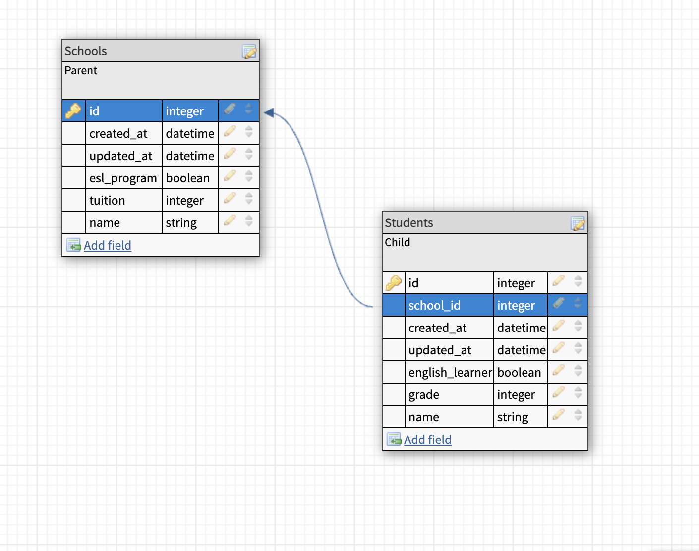

# README

This README would normally document whatever steps are necessary to get the
application up and running.

Things you may want to cover:

* Ruby version

ruby 2.7.4p191

Rails 5.2.8.1

* Configuration
$ rails new "name_of_project" -T -d="postgresql" --skip-spring --skip-turbolinks

rails new is the command to create a new Rails app - this will create a lot of directories and files; we will explore this file structure in a moment. "name_of_project" is going to be the name of the directory in which our Rails app lives and is, essentially, the name of our application. -T tells Rails that we are not going to use its default testing suite. During the module, we will be using a new testing framework, RSpec, and will save that for class time. -d="postgresql" tells Rails that we will be using a postgresql database; Rails can handle many different databases, but this is the one we will be using in Mod2.

* Database creation
  To create a database, run this in the command line in terminal:
  rails db:create

* Database initialization
  rails db:{drop,create,migrate,seed}

* How to run the test suite

bundle exec rpsec

* Schema picture

